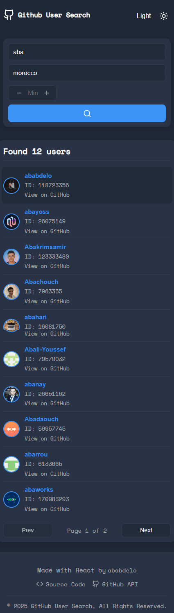
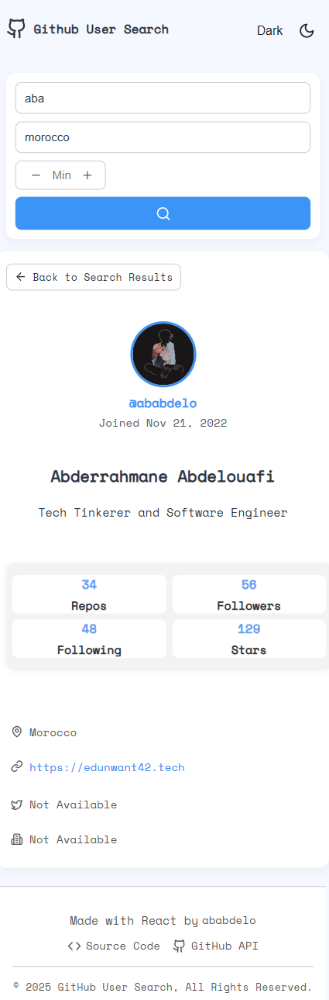
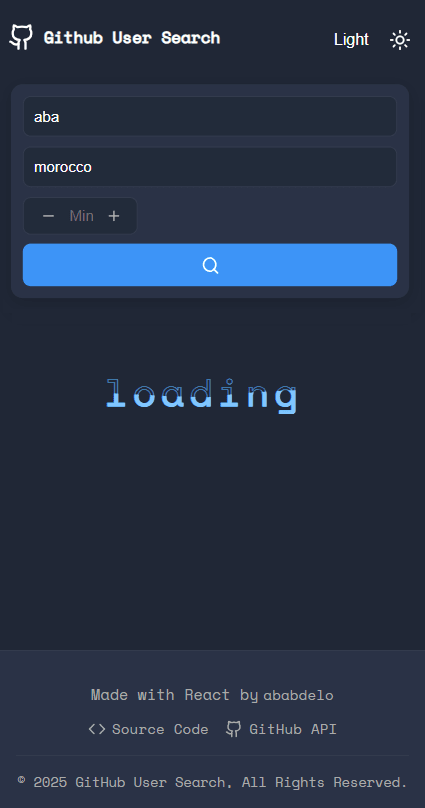
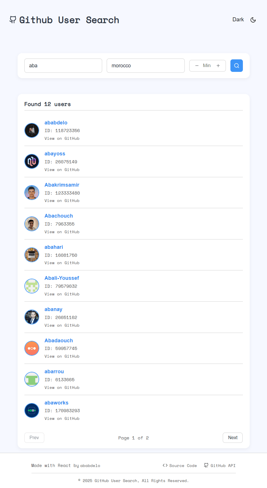
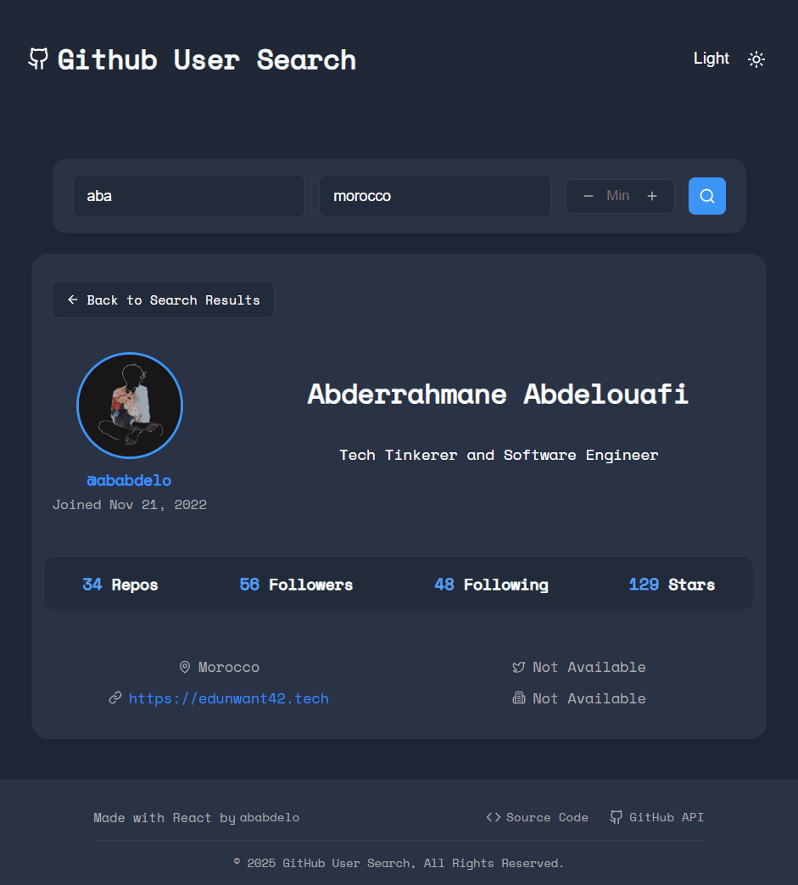
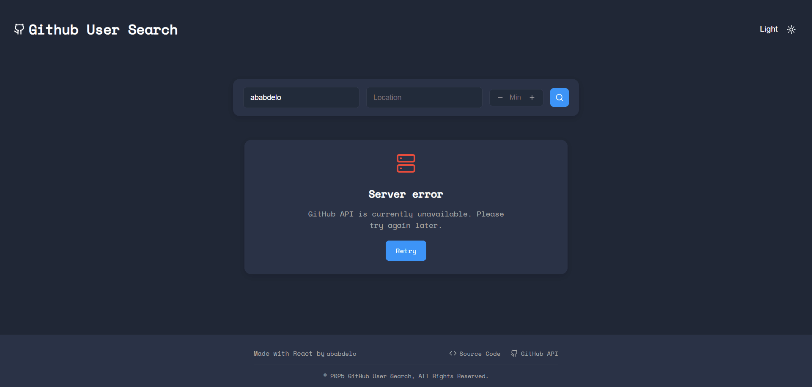
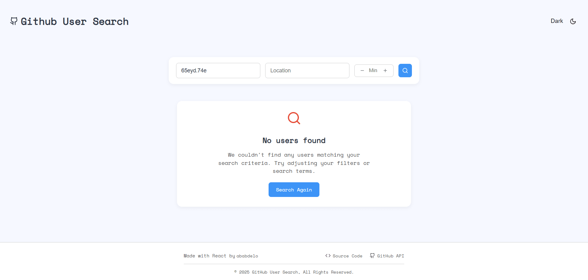

# GitHub User Search 🔍

A modern, responsive React Web Application for searching and discovering GitHub users with advanced filtering capabilities. Built with Vite, featuring both light and dark themes, and optimized for all device sizes.

## ✨ Features

- **Advanced Search**: Search users by username, location, and minimum repository count
- **Detailed User Profiles**: View comprehensive user information including bio, stats, and social links
- **Star Count Display**: See total stars earned across all user repositories
- **Responsive Design**: Optimized for desktop, tablet, and mobile devices
- **Dark/Light Theme**: Toggle between themes for better user experience
- **Real-time Loading States**: Smooth loading animations and error handling
- **Pagination**: Navigate through search results efficiently

## 🎨 Preview

### Search Results Interface

<div align="center">

| Mobile Dark Theme | Mobile Light Theme | Mobile Dark Theme |
|:-----------------:|:------------------:|:------------------:|
|  |  |  |

| Tablet Light Theme | Tablet Dark Theme |
|:------------------:|:-----------------:|
|  |  |

</div>

### Error Handling

<div align="center">

| Server Error | No Results Found |
|:-------------:|:----------------:|
|  |  |

</div>

## 🚀 Technologies Used

- **React js** - Modern React with hooks
- **JavaScript (ES6+)** - Modern JavaScript features
- **CSS3** - Custom CSS with CSS Variables for theming
- **GitHub REST API** - Real-time user data via native fetch()
- **Lucide React** - Beautiful icon library

## 🌐 Live Demo
**Try it now:** [GitHub User Search](https://ababdelo.github.io/GitHub-user-search/)

## 🛠️ Local Development
Want to run it locally or contribute? Follow the installation steps below:

1. **Clone the repository**
   ```bash
   git clone https://github.com/ababdelo/github-user-search.git
   cd github-user-search
   ```

2. **Install dependencies**
   ```bash
   npm install
   npm install --save lucide-react
   ```

3. **Set up environment variables** (Optional - for higher rate limits)
   ```bash
   # Create .env file in root directory
   VITE_APP_GITHUB_API_KEY=your_github_personal_access_token
   ```

4. **Start the development server**
   ```bash
   npm run dev
   ```

5. **Open your browser**
   ```
   http://localhost:5173
   ```

## 🎯 Usage

1. **Search Users**: Enter a username, location, or set minimum repository count
2. **Browse Results**: Click through paginated search results
3. **View Profiles**: Click on any user to see detailed profile information
4. **Theme Toggle**: Switch between light and dark themes
5. **Mobile Experience**: Enjoy full functionality on any device

## 🔧 API Integration

The app integrates with the GitHub REST API to provide:
- User search with advanced filters
- Detailed user profile information
- Repository data for star count calculation
- Proper error handling and rate limiting

## 📱 Responsive Design

- **Mobile First**: Optimized for mobile devices
- **Tablet Support**: Enhanced layout for tablet screens
- **Desktop Experience**: Full-featured desktop interface
- **Cross-browser**: Compatible with modern browsers

## 🎨 Theme Support

- **Light Theme**: Clean, bright interface
- **Dark Theme**: Easy on the eyes for low-light environments
- **System Integration**: Respects user's system preferences
- **Smooth Transitions**: Animated theme switching

## 🚦 Features in Detail

### Advanced Search
- Username filtering with partial matches
- Location-based user discovery
- Repository count filtering
- Efficient pagination system

### User Profiles
- Avatar and basic information
- Bio and social links
- Repository, follower, and following counts
- **Total stars calculation** across all repositories
- Join date and activity indicators

### Error Handling
- Network error detection
- API rate limit management
- User-friendly error messages
- Retry functionality

## 🤝 Contributing

1. Fork the repository
2. Create a feature branch (`git checkout -b feature/amazing-feature`)
3. Commit your changes (`git commit -m 'Add amazing feature'`)
4. Push to the branch (`git push origin feature/amazing-feature`)
5. Open a Pull Request

## 📄 License

This project is licensed under a **Custom Personal Use License** - see the [license.md](license.md) file for details.

**Key Points:**
- ✅ **Free for personal use** - Use, modify, and learn from the code
- ✅ **Educational purposes** - Perfect for learning and research
- ✅ **Open source** - Full source code available
- ❌ **No commercial use** - Commercial licensing available separately

For commercial licensing inquiries, please contact: [https://edunwant42.tech](https://edunwant42.tech)

## 👨‍💻 Author

**Abderrahmane Abdelouafi**
- Portfolio: [https://ed42.tech](https://ed42.tech)
- GitHub: [@ababdelo](https://github.com/ababdelo)
- Location: Morocco 🇲🇦

## 🙏 Acknowledgments

- GitHub API for providing comprehensive user data
- Lucide React for beautiful icons
- Vite team for the amazing build tool
- React community for continuous inspiration
